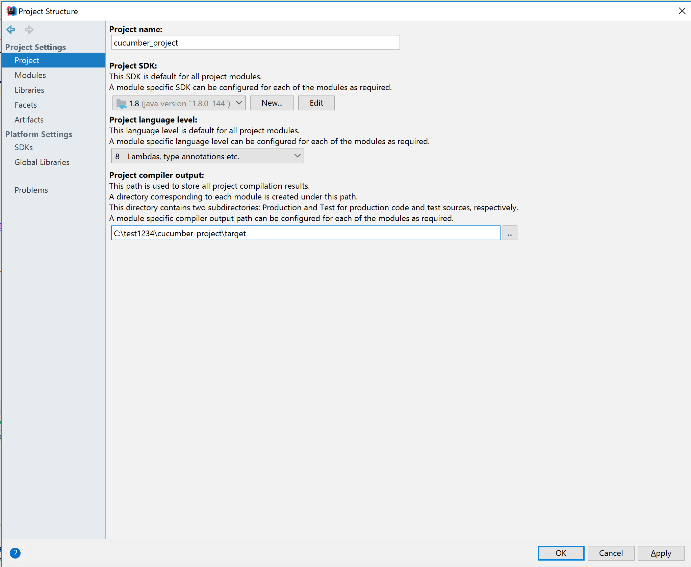

### Structure
* For running tests use [CucumberRunner.java](../master/src/test/java/runners/CucumberRunner.java)
* For step definition use [SampleSteps.java](../master/src/test/java/stepDefinitions/SampleSteps.java)

### Setup 
1. Clone Project:
   
   

2. In IDEA check in project structure, that:
    * Project settings:
      
    * Modules settings:
      
---
### GIT

[see Create a branch](CreateBranch.md)

[see Git add commit and push](GitAddCommitAndPush.md)

